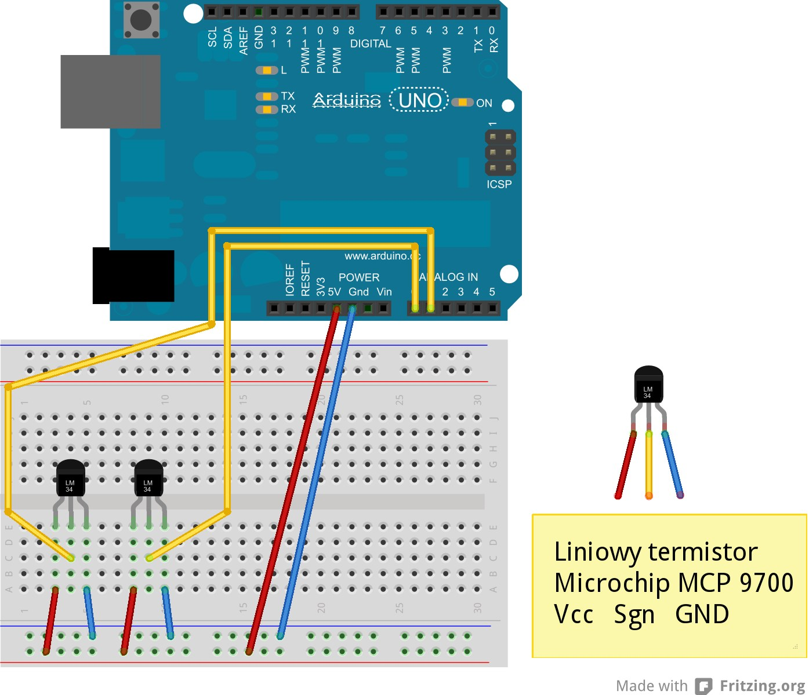
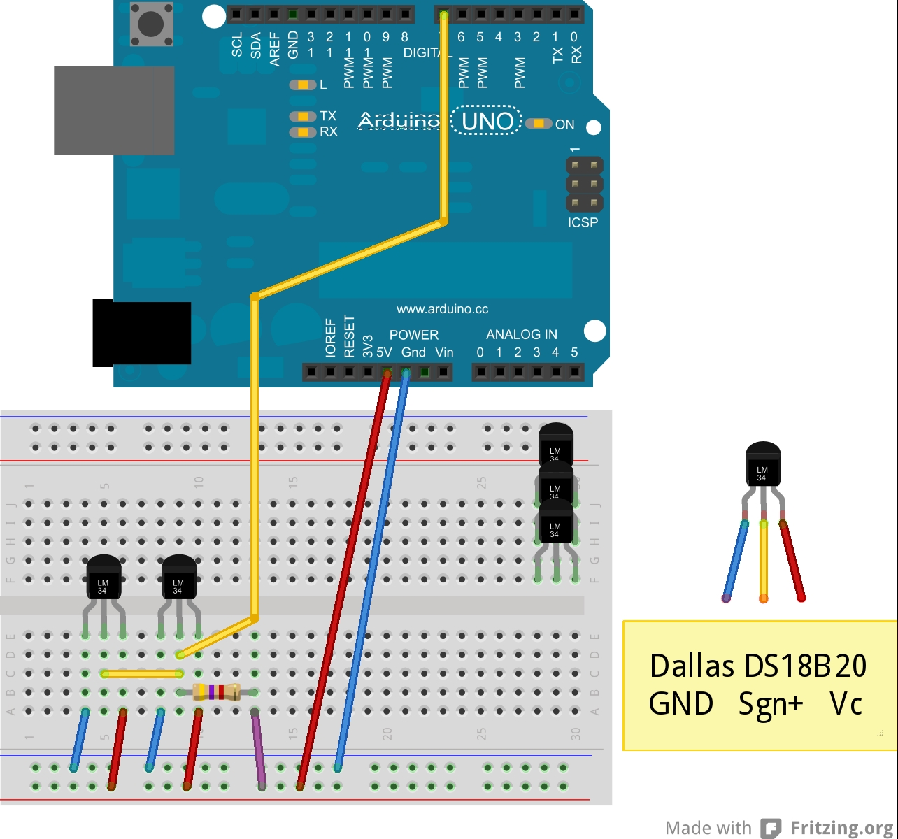
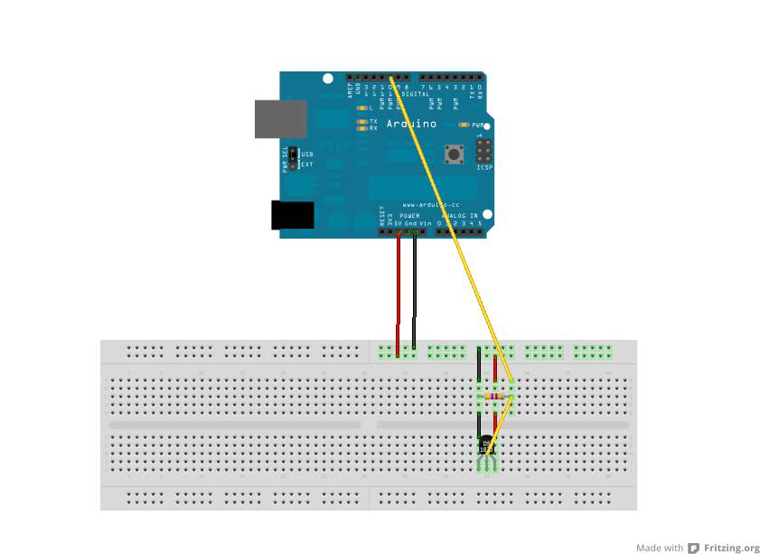
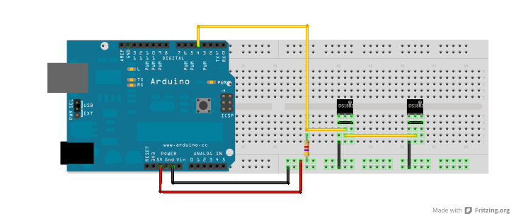
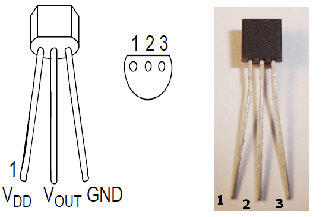
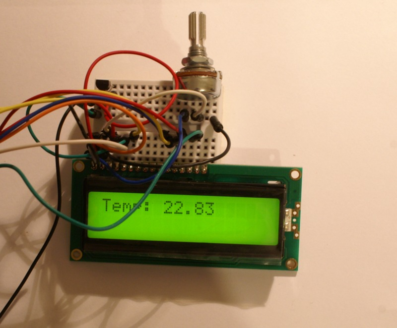
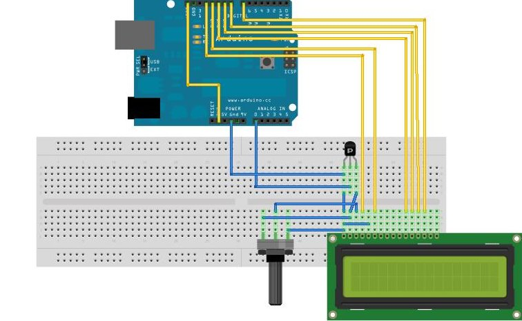

******************
Pomiar temperatury
******************

Odczyt termometru analogowego 
=============================

**Termometr analogowy**

Termometr analogowy jest termistorem, czyli rezystorem reagującym na zmianę temperatury istotną zmianą rezystancji (wszystkie przewodniki zmieniają rezystancję wraz z temperaturą, jednak w porównaniu do termistora, zmiana ta jest nieznaczna).

Pasywny, trójnóżkowy termometr może być układem proporcjonalnym lub mostkiem z termistorem w jednej gałęzi. Termometry aktywne są bardziej skomplikowane i gwarantują znacznie większą liniowość i jej niezależność od napięcia zasilającego, a sygnałem wyjściowym jest nie zmiana rezystancji, a proporcjonalna do temperatury wartość napięcia.

Przykładem może być aktywny analogowy termometr firmy Microchip MCP9700. Termometr ten posiada następujące cechy:

- stała, liniowa zmiana napięcia: :math:`10 \frac{mV}{°C}`,

- dokładność w zakresie od :math:`0 °C` do :math:`+70 °C`: :math:`±4 °C`,

- dokładność w zakresie od :math:`-40 °C` do :math:`+150 °C`: :math:`-4 °C/+6 °C`,

- niski pobór prądu: :math:`12 µA` (max),

- napięcie zasilania: od :math:`2.3 V` do :math:`5.5 V`,

- działanie bez dodatkowych elementów.

**Schemat połączeń**

Termometr MCP9700 dostarczany jest w 3 różnych obudowach. Do projektowania najwygodniej skorzystać z układu z nóżkami w obudowie TO-92.

**UWAGA!** Układ wyprowadzeń w innych termometrach może być różny od poniższego. Np. termometr cyfrowy Dalllas ma masę i zasilanie odwrotnie. Źle podłączony układ bardzo szybko i mocno się nagrzewa.

Wartość napięcia z wyjścia termometru można odczytać za pomocą wejścia analogowego Arduino.

**Kod programu**

.. code-block:: c++

	const int input = A0;
	float temp;

	void setup() 
	{
	  Serial.begin(9600);
	}

	void loop ()
	{
	  temp = analogRead(input)*5/1024.0;
	  temp = temp - 0.5;
	  temp = temp / 0.01;
	  Serial.println(temp);
	  delay(500);
	}

`Źródło.`_

Odczyt termometru cyfrowego 
===========================

Układ DS18B20 jest cyfrowym czujnikiem temperatury produkowanym przez firmę Dallas Semiconductor. Umożliwiają pomiar temperatury w zakresie od :math:`-55 °C` do :math:`+125 °C` z dokładnością do trzech miejsc po przecinku (12 bitów). Termometr wyposażony jest przez producenta w interfejs OneWire, który charakteryzuje się prostą obsługą, małymi wymaganiami dotyczącymi linii transmisyjnej i możliwością równoległego łączenia urządzeń.

**Specyfikacja:**

- Napięcie zasilania: od :math:`3.0 V` do :math:`5.5 V`

- Zakres pomiarowy: od :math:`-55 °C` do :math:`125 °C`

- Dokładność: :math:`± 0.5 °C` w zakresie od :math:`-10 °C` do :math:`85 °C` 

- Rozdzielczość: od 9 do 12 bitów

Z Arduino termometr DS18B20 obsłużyć można za pomocą dostarczanej standardowo biblioteki OneWire. Biblioteka ta dostarcza jednak tylko obsługę interfejsu, a nie konkretnych czujników. Można je oprogramować samodzielnie, lecz wygodniej skorzystać z biblioteki DallasTemperature, którą można pobrać ze strony `autora`_. Archiwum należy rozpakować do katalogu programu w podkatalogu \libraries (np. C:/Program Files/Arduino-1.0.2/libraries/). Biblioteka musi znajdować się we własnym katalogu o nazwie bez spacji, podkreśleń czy myślników.

Termometr podłączamy zgodnie ze schematem. Trzymając płaską powierzchnią do siebie i nóżkami w dół, lewa nóżka to masa, a prawa zasilanie. Środkowa nóżka jest sygnałowa, ale musi zostać podciągnieta do zasilania przez rezystor :math:`4.7 kΩ` (lub podobnie, równie dobrze mogą to być 2 równolegle połączone :math:`10 kΩ`).

Odczyt temperatury z jednego czujnika
-------------------------------------

.. code-block:: c++

	#include <OneWire.h>
	#include <DallasTemperature.h>

	// Data wire is plugged into pin 7 on the Arduino
	#define ONE_WIRE_BUS 7

	// Setup a OneWire instance to communicate with ANY OneWire devices 
	OneWire oneWire(ONE_WIRE_BUS);

	// Set OneWire reference to Dallas Temperature sensor. 
	DallasTemperature sensors(&oneWire);

	void setup(void)
	{
	  Serial.begin(9600);
	  sensors.begin();
	}

	void loop(void)
	{
	  sensors.requestTemperatures();
	  Serial.println("");
	  delay(500);
	  Serial.print("Sensor 1: ");
	  Serial.println(sensors.getTempCByIndex(0)); \\ first founded sensor have Index 0
	}

Odczyt temperatury z kilku czujników
------------------------------------

Odczyt wartości z kilku czujników można zrealizować na kilka sposobów. Jeden z nich polega na odczycie wg indeksów nadawanych przy inicjalizacji magistrali, wykorzystując funkcję ``getTempCByIndex(<m>)``, gdzie ``<m>`` jest kolejnym numerem czujnika w zakresie od :math:`0` do :math:`(n-1)`.

.. code-block:: c++

	// piece of code

	Serial.println("Sensor 1: ");
	Serial.println(sensors.getTempCByIndex(0));
	delay(500);
	Serial.println("Sensor 2: ");
	Serial.println(sensors.getTempCByIndex(1));

Drugą metodą, bardziej sensowną z punktu widzenia eksploatacji projektowanych urządzeń, jest wykorzystanie unikatowego adresu każdego z urządzeń magistrali OneWire, zapamiętanie ich w tablicy i odczytywanie wartości z kolejnych czujników poprzez wskazanie ich po adresie. Adresy urządzeń można uzyskać, korzystając z polecenia *ds.search(addr)*. Typ urządzenia można rozpoznać po najbardziej znaczących bajtach adresu (podobnież, sześć pierwszych bajtów adresu MAC kart sieciowych jest przypisanych do producenta) – dla czujnika Dallas DS18B20 jest to 0 × 28.

.. code-block:: c++

	#include <OneWire.h>
	// DS18S20 Temperature chip i/o
	OneWire ds(7); // on pin 7
	
	void setup(void)
	{
	  Serial.begin(9600);
	}

	void loop(void) 
	{
	  byte i;
	  byte present = 0;
	  byte data[12];
	  byte addr[8];

	  if ( !ds.search(addr)) 
	  {
	    Serial.print("No more addresses.\n");
	    ds.reset_search();
	    return;
	  }

	  Serial.print("R=");

	  for( i = 0; i &lt; 8; i++) 
	  {
	    Serial.print(addr[i], HEX);
	    Serial.print(" ");
	  }

	  if ( OneWire::crc8( addr, 7) != addr[7])
	  {
	    Serial.print("CRC is not valid!\n");
	    return;
	  }

	  if ( addr[0] == 0x10)
	  {
	    Serial.print("Device is a DS18S20 family device.\n");
	  }

	  else if ( addr[0] == 0x28) 
	  {
	    Serial.print("Device is a DS18B20 family device.\n");
	  }

	  else 
	  {
	    Serial.print("Device family is not recognized: 0x");
	    Serial.println(addr[0],HEX);
	    return;
	  }

	  ds.reset();
	  ds.select(addr);
	  ds.write(0x44,1); // start conversion, with parasite power on at the end
	  delay(1000); // maybe 750ms is enough, maybe not
	  // we might do a ds.depower() here, but the reset will take care of it.
	  present = ds.reset();
	  ds.select(addr);
	  ds.write(0xBE); // Read Scratchpad
	  Serial.print("P=");
	  Serial.print(present,HEX);
	  Serial.print(" ");

	  for ( i = 0; i &lt; 9; i++) 
	  {
	    // we need 9 bytes
	    data[i] = ds.read();
	    Serial.print(data[i], HEX);
	    Serial.print(" ");
	  }

	  Serial.print(" CRC=");
	  Serial.print( OneWire::crc8( data, 8), HEX);
	  Serial.println();

	}

`Źródło.`_

Czujnik MCP9700-E/TO i wykres temperatury
=========================================

MCP9700-E/TO to czujnik analogowy, nie potrzebujący żadnych dodatkowych elementów do działania.

Podłączenie nóżek:

- 1 :math:`\Longleftarrow` napięcie zasilania (nadaje się zarówno :math:`5 V`, jaki i :math:`3.3 V`)

- 2 :math:`\Longleftarrow` pin A0

- 3 :math:`\Longleftarrow` masa

Czułość: :math:`10 \frac{mV}{ºC}`

Szczegóły w `dokumentacji <nettigo.pl/attachments/18>`_.

.. code-block:: c++

	const int input = A0;
	const int led = 10;

	void setup()
	{
	  pinMode(input, INPUT);
	  pinMode(led, OUTPUT);
	  Serial.begin(9600);
	}

	int x, y;
	float temp;

	void loop()
	{
	  x = analogRead(input);
	  temp = x*5/1.023;  //otrzymujemy wartość w mV (gdybyśmy napisali 1023.0, zamiast 1.023, wynik otrzymalibyśmy w V)
	  temp = temp - 500;  //skalujemy do 0 °C – różnica między napięciem odczytanym z czujnika a 500 mV jest liniowo zależna od temperatury
	  temp = temp/10;  //tę różnicę dzielimy przez 10, aby otrzymać stopnie Celcjusza
	}

Do powyższego programu dołączymy teraz diodę, reagującą na zmianę temperatury oraz możliwość odczytu monitora portu szeregowego.

.. code-block:: c++

	const int input = A0;
	const int led = 10;

	void setup() 
	{
	  pinMode(input, INPUT);
	  pinMode(led, OUTPUT);
	  Serial.begin(9600);
	  Serial.println("!");
	}

	int x, y;
	float temp;

	void loop() 
	{
	  x = analogRead(input);
	  temp = x/2.046-50;			//odczyt w mV
	  x = floor(temp*10);
	  y = map(x,250,350,0,255);		//dopasowujemy przedział tak, żeby dioda reagowała odpowiednio intensywnie
	  y = constrain(y,0,255);
	  analogWrite(led,y);
	  if (Serial.available() > 0)
	  {
	    if (Serial.read() == '!')
	    {
	      Serial.println(temp);
	    }
	  }
	}

Treść pliku o rozszerzeniu .py, umożliwiająca nam podgląd wykresu temperatury:

.. code-block:: python

	import pylab, numpy, serial, time
	port = serial.Serial('/dev/ttyACM0',9600)
	time.sleep(1)

	port.readline()
	dane = []

	for x in xrange(100):
		port.write("!")
		dane.append(float(port.readline()))

	X = numpy.arange(100)
	Y = numpy.array(dane)
	pylab.ion()
	wykres = pylab.plot(X, Y)[0]
	pylab.ylim([20, 37])

	while True:
		port.write("!")
		dane.append(float(port.readline()))
		dane = dane[1:]
		wykres.set_ydata(numpy.array(dane))
		pylab.draw()
		pylab.pause(0.1)
 
Treść pliku o rozszerzeniu .py, umożliwiająca nam podgląd wykresu uśrednionej temperatury:

.. code-block:: python

	import pylab, numpy, serial, time

	step = 40

	port = serial.Serial('/dev/ttyACM0',9600)
	time.sleep(1)
	port.readline()

	def ma(Y):
		return [sum(Y[x:x+step])/float(step) for x in range(len(Y)-step+1)]

	dane = []

	for x in xrange(100):
		port.write("!")
		dane.append(float(port.readline()))

	X = numpy.arange(100-step+1)
	Y = numpy.array(ma(dane))
	pylab.ion()
	wykres = pylab.plot(X, Y)[0]
	pylab.ylim([20, 37])

	while True:
		port.write("!")
		dane.append(float(port.readline()))
		dane = dane[1:]
		wykres.set_ydata(numpy.array(ma(dane)))
		pylab.draw()
		pylab.pause(0.1)

Czujnik MCP9700-E/TO i moduł LCD
================================

MCP9700-E/TO to czujnik analogowy, nie potrzebujący żadnych dodatkowych elementów do działania.

Podłączenie nóżek:

- 1 :math:`\Longrightarrow` napięcie zasilania (nadaje się zarówno :math:`5 V`, jaki i :math:`3.3 V`)

- 2 :math:`\Longrightarrow` pin A0

- 3 :math:`\Longrightarrow` masa

Czułość: :math:`10 \frac{mV}{ºC}`

Szczegóły w `dokumentacji <nettigo.pl/attachments/18>`_.

Wykorzystany w przykładzie zestaw LCD dla Arduino to moduł LCD alfanumeryczny, 2×16 z przylutowaną złączką pasującą do płytki prototypowej, oraz potencjometr :math:`10 kΩ`, liniowy do regulacji kontrastu. Moduł LCD posiada kontroler zgodny z HD44780, co oznacza, że biblioteka LiquidCrystal będzie go obsługiwała.

`Szczegóły i dokumentacja. <http://nettigo.pl/products/32>`_

.. code-block:: c++

	#include <LiquidCrystal.h>
	float temp;
	LiquidCrystal lcd (12,11,10,9,8,7);

	void setup()
	{
	  analogReference(EXTERNAL);
	}

	void loop ()
	{
	  temp = analogRead(0)*3.3/1024.0;
	  temp = temp - 0.5;
	  temp = temp / 0.01;
	  delay(500);
	  lcd.print("Temp: ");
	  lcd.print(temp);
	  lcd.print("        ");
	  lcd.setCursor(0,0);
	}

``LiquidCrystal lcd (12,11,10,9,8,7);`` definiuje zmienną ``lcd``, przez którą będziemy się komunikować z modułem. Tutaj podano, do których pinów Arduino podłączamy kolejno:

- pin RS modułu (tutaj pin 12),

- pin ENABLE modułu (pin 11),

- pin danych modułu D4 (pin 10), 

- pin danych modułu D5 (pin 9), 

- pin danych modułu D6 (pin 8), 

- pin danych modułu D7 (pin 7).

Poza tym do modułu musimy podłączyć zasilanie oraz sygnał R/W modułu LCD do masy. Następnie regulujemy kontrast. Odbywa się to przez podanie napięcia między :math:`0 V` a :math:`5 V` na pin :math:`V_{0}` modułu. Aby móc je regulować skorzystamy z potencjometru będącego w zestawie. Następnie w pętli ``loop`` odczytujemy temperaturę z czujnika. Mając temperaturę wyświetlamy napis ``Temp:``, potem wartość odczytu i wracamy na początek linii.

Więcej na http://starter-kit.nettigo.pl/2010/03/temperatura-i-lcd/.

Pomiar temperatury wody
=======================

Problem podczas pomiaru temperatury wody oceanicznej związany jest z pływami – podczas przypływu poziom wody podnosi się, utrudniając komunikację. Pomiar temperatury słonej wody, i to w dodatku na zewnątrz, niesie ze sobą pewne komplikacje. Słona woda i elektronika nie są najlepszym połączeniem. Musimy się więc upewnić, że utrzymujemy sprzęt w suchych i bezpiecznych warunkach, a jednocześnie jest on w stanie dokonać dokładnego pomiaru. Rozwiązaniem problemu może być umieszczenie sprzętu w solidnym, plastikowym pojemniku na żywność, ponieważ są one zwykle bardzo szczelne. Konieczne jest jednak wykonanie otworów na czujniki i właściwe ich uszczelnienie wokół przewodów.

**Materiały:**

- Arduino Uno

- Arduino GSM shield

- 1-Wire czujnik temperatury Dallas Semiconductor DS18B20, regularny i wodoodpodporny

- płytka prototypowa typu Tri-pad

- Karta SIM typu Prepaid (przedpłacona)

- skrzynka i zatrzaski na baterie i baterie AA

- Diody LED, czerwone i zielone

- Rezystory

- Przewód elektryczny, złącze szpilkowe

- Pas zaciskowy z regulacją

- Solidne plastikowe pudełko z pokrywką

W naszym przypadku wyboru czujników temperatury, zastosowaliśmy wodoodporną wersję do pomiaru temperatury wody oraz koszulkę termokurczliwą (`wiki <http://en.wikipedia.org/wiki/Heat-shrink_tubing>`_) do ochrony zwykłego czujnika, służącego nam do pomiaru temperatury powietrza.

Shieldy Arduino to płytki, umożliwiające wykorzystanie dodatkowych funkcji w Arduino. Do tego projektu użyto schieldu GSM, aby umożliwić wysyłanie danych do naszego przyszłego serwisu.

Shield GSM wymaga aktywowanej karty SIM, aby móc połączyć się z siecią komórkową.

Jednym z prostszych sposobów na podłączenie pozostałych elementów do Arduino, jest zrobienie z płytki prototypowej czegoś w rodzaju shieldu i przylutowanie jej z pomocą złącza szpilkowego, a następnie przylutowanie pozostałych elementów do płytki.

Zauważmy, że końcówki kabli wchodzące do pinów nie są widoczne; zamiast tego używane elementy zostają połączone z odpowiednim pinem za pomocą linii. Dodatkowo, ponieważ patrzymy na płytkę od spodu, rozmieszczenie elementów na płytce jest widokiem z lustra.

**Utworzenie zaplecza**

`Xively`_ (dawniej Pachube, Cosm) to platforma chmury obliczeniowej służąca do podłączania urządzeń do Internetu Przedmiotów (`wiki <http://en.wikipedia.org/wiki/Internet_of_Things>`_). Oferuje ona łatwy sposób wysyłania danych do serwisu i tworzenia aplikacji w oparciu o usługi i dane. Istnieje również kilka innych tego rodzaju platform, ale Xively wydaje się najłatwiejsza w użyciu, zapewniając jednocześnie odpowiednio dużo dokumentacji. 

Kiedy już się zalogujemy, utworzenie nowego odbiornika jest bardzo proste. Na karcie developer workbench znajduje się przycisk *+ Add Device*. Podczas dodawania urządzenia możemy wybrać jego nazwę, opis oraz ustawienia prywatności. To doprowadzi nas do ekranu podstawowego przeglądu dla tego urządzenia. Aby móc gromadzić dane, musimy rozpocząć działanie co najmniej jednego kanału. Podobnie jak w przypadku urządzeń, korzystamy z przycisku *+Add Channel*. Gdy to nastąpi, należy zapamiętać swój kanał oraz nazwę urządzenia, a następnie skopiować adres API i numer kanału. W celu ograniczenia uprawnień można nawet wygenerować nowy klucz API (za pomocą *+Add Key*) z innymi uprawnieniami niż domyślny klucz, generowany automatycznie. 

Kiedy mamy już nasze dane, Xively może zobrazować je nam na wykresie i prowadzony jest rejestr dokonanych pomiarów, umożliwiając obserwację stanu urządzenia. Możemy zrobić nawet Xively wyzwalacz (`wiki <http://en.wikipedia.org/wiki/Database_trigger>`_) HTTP POST żądań w różnych warunkach, przy użyciu przycisku *+Add Tigger*. W naszym przypadku Xively jest ustawione na wywoływanie żądania POST do aplikacji internetowej online, synchronizującej usługi. Gdy nasz odbiornik nie otrzymuje żadnych danych przez określony czasu, wysyłany jest do nas e-mail na ten temat.

**Programowanie czujnika**

W tym projekcie używamy dwóch wejściowych pinów dla czujnika temperatury oraz dwóch wyjściowych pinów dla diod LED, określających stan naszego układu. Inicjujemy piny 8 i 10 na wyjście oraz 12 i 13 na wejście. W ogólności dla czujników temperatury używamy transmisji danych przez magistralę OneWire, ale tutaj wykorzystujemy jeden pin na czujnik (co czyni OneWire niepotrzebnym). Definiujemy piny jako zmienne typu integer:

.. code-block:: c++

	int air_pin = 12;
	int water_pin = 13;
	int redLed = 10;
	int greenLed = 8;

Program działa z wykorzystaniem różnych bibliotek:

- `GSM.h`_ jest potrzebna do komunikacji z shieldem GSM.

- `HttpClient.h`_ i `Xively.h`_ są potrzebne, by zamieszczać wartości w Xively.

- `OneWire.h`_ stanowi wsparcie dla komunikacji z urządzeniami OneWire.

- Biblioteka `Temperature.h`_ jest biblioteką zebraną przez `zespół M2M`_ na podstawie `Buildr example`_ w celu łatwiejszego uzyskania danych temperaturowych z czujników bez konieczności posiadania dużej wiedzy o OneWire. 

.. code-block:: c++

	#include <GSM.h>
	#include <HttpClient.h>
	#include <Xively.h>
	#include <OneWire.h> 
	#include <Temperature.h>

Następnie definiujemy zmienne używane do obsługi shieldu GSM. Potrzebny jest kod PIN do karty SIM, APN (Access Point Name), nazwa użytkownika oraz hasło. Informacje te są niezbędne do ustanowienia połączenia GPRS do transmisji danych w sieci GSM. Następnie tworzymy trzy obiekty typów: GSMClient, GPRS i GSM.

.. code-block:: c++

	#define PINNUMBER "PIN"
	#define GPRS_APN "APN"
	#define GPRS_LOGIN "USERNAME"
	#define GPRS_PASSWORD "PASSWORD"

	GSMClient client;
	GPRS gprs;
	GSM gsmAccess;

Następnie tworzymy dwa obiekty OneWire, po jednym dla każdego czujnika, przy użyciu numeru pinu w formie wymaganej przez konstruktor. Ponieważ nie używamy więcej niż jednego czujnika na jednym pinie, zmienne te są różne dla każdego obiektu.

.. code-block:: c++

	OneWire water(water_pin);
	OneWire air(air_pin);

Musimy również zapewnić pewne informacje bibliotece `Xively`_ dla naszego urządzenia, aby móc przekazywać dane tam, gdzie chcemy. Najpierw należy zdefiniować identyfikator ID odbiornika, który znajduję się w górnej części strony internetowej odbiornika na `xively.com <https://xively.com/>`_. Następnie tworzymy trzy tablice typu ``char``: pierwszą dla klucza API (to również można znaleźć na stronie odbiornika), drugą dla strumienia danych czujnika temperatury wody i trzecią dla strumienia danych czujnika temperatury powietrza. Nazwy strumieni muszą się zgadzać z nazwami na stronie internetowej odbiornika. Następnie tworzymy strumień danych, odbiornik i mówimy `Xively`_, z jakiego adresu IP dane będą wysyłane. Wreszcie, tworzymy obiekt ``Temperature``, który będzie używany do pobierania danych z czujników.

.. code-block:: c++

	#define FEED_ID 123456789
	char xivelyKey[] = "API_KEY";
	char myWaterTempStream[] = "water";
	char myAirTempStream[] = "air";
	unsigned long lastTime = millis();

	XivelyDatastream datastreams[] = { 
	XivelyDatastream(myWaterTempStream, strlen(myWaterTempStream), DATASTREAM_FLOAT),
	XivelyDatastream(myAirTempStream, strlen(myAirTempStream), DATASTREAM_FLOAT),
	};

	XivelyFeed feed(FEED_ID, datastreams, 2);
	XivelyClient xivelyclient(client);

	Temperature temp;

Teraz, po zakończeniu deklarowania zmiennych i obiektów, zostają nam dwie procedury: ``setup`` i ``loop``. Procedura ``setup`` wykonuje się tylko raz, po załadowaniu programu na płytkę Arduino lub po wciśnięciu przycisku *Reset*. Używamy jej do zdefiniowania wejść i wyjść i uruchomienia połączenia GPRS. Używamy zmiennej logicznej o nazwie ``notConnected``, żeby śledzić stan połączenia. Funkcja ``gsmAccess.begin()`` rozpoczyna pracę modemu oraz zwraca jego stan, a ``gprs.attachGPRS()`` inicjuje połączenie GPRS i zwraca stan połączenia. Chociaż nie jest to pokazane w przykładach Arduino, te dwie funkcje powinny być wywoływane z opóźnieniem pomiędzy sobą. Jeśli modem zwraca ``GSM_READY``, a połączenie zwraca ``GPRS_READY``, jesteśmy w kontakcie i aktualizujemy ``notConnected``. Kiedy jesteśmy połączeni, to zapala się zielona dioda LED, w innym wypadku świeci czerwona dioda.

.. code-block:: c++

	void setup(void)
	{
	  pinMode(redLed, OUTPUT);
	  pinMode(greenLed, OUTPUT);
	  boolean notConnected = true;
	  while (notConnected)
	  {
	    digitalWrite(redLed, HIGH);
	    digitalWrite(greenLed, LOW);
	    if(gsmAccess.begin(PINNUMBER)==GSM_READY)
	    {
	      delay(3000);
	      if(gprs.attachGPRS(GPRS_APN, GPRS_LOGIN, GPRS_PASSWORD)==GPRS_READY)
	      {
	        notConnected = false;
		digitalWrite(redLed, LOW);
		digitalWrite(greenLed, HIGH);
	      }
	    }
	    else
	    {
	      delay(1000);
	    }
	  }
	}

Procedura ``loop`` działa nieprzerwanie tak długo, jak zasilane jest Arduino, zatrzymując się tylko na ``interrupts``, podczas których będziemy robić nasze pomiary i przesyłać do `Xively`_. Pierwszą rzeczą, jaką będziemy robić w instrukcji ``if`` jest sprawdzenie, czy minęło :math:`60 s`. Interwał ten określa, jak często pomiary są robione i przesyłane. Funkcja ``.getTemp()`` w bibliotece Temperature zwraca temperaturę czujnika przy użyciu obiektu OneWire jako wartości typu ``float``. Wykorzystujemy to, aby uzyskać temperaturę obu naszych czujników i umieścić wartości w dwóch strumieniach danych.

.. code-block:: c++

	if((millis()-lastTime)>=60000)
	{
	  lastTime = millis();
	  temperature = temp.getTemp(water);
	  datastreams[0].setFloat(temperature);
	  temperature = temp.getTemp(air);
	  datastreams[1].setFloat(temperature);

Teraz mamy wszystko, czego potrzebujemy i jesteśmy gotowi, żeby zamieścić wartości na `Xively`_. Odbywa się to przy użyciu funkcji ``xivelyclient.put()``. Przyjmuje ona odbiornik i klucz API jako wejściowe parametry, a zwraca kod odpowiedzi. Jeśli próba połączenia powiodła się (kod odpowiedzi 200), miga zielona dioda LED, inaczej miga czerwona.

.. code-block:: c++

	int ret = xivelyclient.put(feed, xivelyKey);

	if(ret == 200)
	{
	  digitalWrite(greenLed, LOW);
	  delay(100);
	  digitalWrite(greenLed, HIGH);
	}

	else
	{
	  digitalWrite(redLed, HIGH);
	  delay(100);
	  digitalWrite(redLed, LOW);
	}

Jeśli wszystko odbyło się zgodnie z planem, powinniśmy posiadać działający czujnik, który przesyła dwie wartości temperatury do `Xively`_ i wyświetla informacje o połączeniu za pomocą dwóch diod LED. Pełną wersję kodu można znaleźć na `GitHubie`_.

Więcej na http://comoyo.github.io/blog/2013/08/01/m2m_adventures/.

.. _BOTLAND: http://botland.com.pl/
.. _GSM.h: http://arduino.cc/en/Reference/GSM
.. _HttpClient.h: https://github.com/amcewen/HttpClient
.. _Xively.h: https://github.com/xively/xively_arduino
.. _OneWire.h: http://www.pjrc.com/teensy/td_libs_OneWire.html
.. _Temperature.h: https://github.com/comoyo/BeachSensor/tree/master/Temperature
.. _zespół M2M: http://comoyo.github.io/blog/2013/08/01/m2m_adventures/
.. _Buildr example: http://bildr.org/2011/07/ds18b20-arduino/
.. _autora: http://milesburton.com/
.. _Xively: https://xively.com/
.. _Źródło.: http://tomczak.org.pl/
.. _GitHubie: http://comoyo.github.io/blog/2013/08/01/m2m_adventures/
