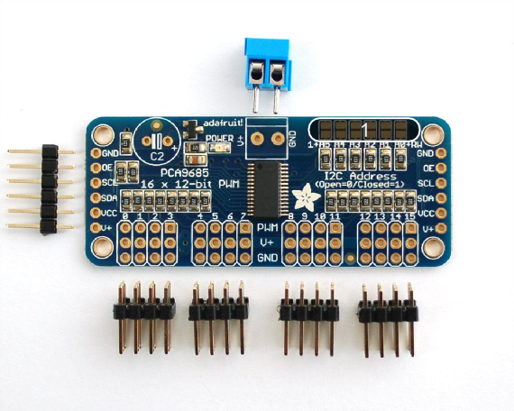
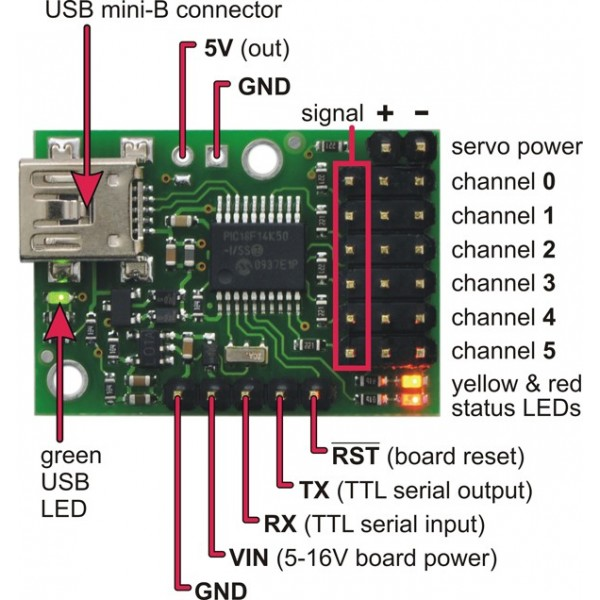

***************
Serwomechanizmy
***************

Obsługa serwomechanizmów
===========================

16-sto kanałowy sterownik serwomechanizmów z interfejsem I2C
-------------------------------------------------------------

:Opis:

Jest to moduł do sterowania 16 serwomechanizmami za pomocą magistrali I2C (TWI). Jest zbudowany na układzie PCA9685, który jest scalonym 16-sto kanałowym generatorem PWM o rozdzielczości 12 bitów. Moduł posiada niewlutowane złącza typu goldpin, do których można wpiąć bezpośrednio modelarskie wtyczki serwomechanizmów. Układ sterujący pracuje w standardach :math:`3.3 V` i :math:`5 V` zależnie od zasilania. Serwomechanizmy zasilane są niezależnie. Adres generatora składa się z na stałę ustawionego 7 bitu adresu i konfigurowlnych pozostałych 6 bitów za pomocą zworek. Dzięki temu do jednej magistrali I2C można podłączyć do 62 modułów generatora, uzyskując 992 wyjścia PWM lub sterowane serwomechanizmy.
Podłączenie do Arduino Uno R3 odbywa się za pomocą SDA, SCL oraz pinów :math:`5 V` i GND z grupy "POWER"

:Kod:

Program testowy ustawia kolejne wyjścia serwomechanizmów na każdy kąt ich osi. Program ustawia generator PWM na :math:`60 Hz` ``pwm.setPWMFreq(60);``. Oznacza to, że licznik generatora PWM liczy od 0 do 4095 - 60 razy na sekundę.

.. code-block:: c++

	// Biblioteki współpracujące z modułem
	#include <Wire.h>
	#include <Adafruit_PWMServoDriver.h>

	// Adres modułu (wszystkie zworki rozwarte)
	#define PCF_ADDRESS 0x40

	// Tworzenie obiektu
	Adafruit_PWMServoDriver pwm = Adafruit_PWMServoDriver(PCF_ADDRESS);

	// Wartości dla generatora dla impulsu 1000 us i 2000 us, czyli minimalny i maksymalny impuls dla serwomechanizmu
	#define SERVO_PULSE_MIN 250
	#define SERVO_PULSE_MAX 500

	// Funkcja zamieniająca kąt osi serwa od 0 do 180 stopni na wartość wysyłaną do generatora PWM
	void servoWrite(byte servo, byte angle)
	{
	  pwm.setPWM(servo, 0, map(angle, 0, 180, SERVO_PULSE_MIN, SERVO_PULSE_MAX));
	}

	void setup()
	{
	  // Uaktwynienie generatora
	  pwm.begin();
	  // Ustawienie częstotliwości PWM na 60 Hz
	  pwm.setPWMFreq(60);
	}

	void loop()
	{
	  // Ustawianie kolejnych wyjść serwomechanizmów na każdy kąt
	  for (byte servo=0; servo<16; servo++)
	  {
	    for (byte angle=0; angle<180; angle++)
	    {
 	      servoWrite(servo, angle);
 	      delay(100);
	    }
	  }
	}

`Tutaj <https://github.com/adafruit/Adafruit-PWM-Servo-Driver-Library>`_ znajduje się bibliotekę do obsługi modułu.

Więcej informacji można znaleźć na `stronie sklepu Nettigo <http://nettigo.pl/products/380>`_.

Sterownik serw Pololu Micro Maestro
----------------------------------------------

:Opis:

Jest to kontroler serwomechanizmów z obsługą sygnałów cyfrowych i analogowych. Dostępne są 6, 12, 18 i 24 kanałowe moduły. Wyprowadzenia to popularne listwy goldpin (raster 2,54), dopasowane do standardowych złącz serwomechanizmów i przewodów połączeniowych.

:Obsługa sterownika:

Użytkownik ma do dyspozycji sterowanie serwami poprzez:

- **USB** - urządzenie łączy się z komputerem za pomocą przewodu mini USB. W celu skorzystania z opcji sterowania poprzez USB należy pobrać program na dysk (wersja: Windows, Linux), uruchomić go oraz podłączyć kontroler do dowolnego portu USB komputera. Program umożliwia między innymi:

	- sterowanie pozycją orczyka,
	- ustalanie prędkości obrotu serwomechanizmu,
	- odczytywanie danych z wejść analogowych i cyfrowych,
	- nastawianie wartości logicznych na wyjścia I/O.

- **Interfejs szeregowy (UART)** - interfejs pozwala na połączenie Maestro z jednostką centralną, którą może być dowolny mikrokontroler lub zestaw uruchomieniowy np. Arduino, STM32Discovery bądź Rasbperry Pi. Obsługa serwomechanizmów obywa się poprzez wysyłanie specjalnych komend znakowych. Przykłady wraz z opisem poleceń można znaleźć w `instrukcji <http://www.pololu.com/docs/0J40/5>`_.

- **Skrypt** - wybierając tę opcję, użytkownik może stworzyć i zapisać w pamięci Maestro wybraną sekwencje zdarzeń, np. uzależnić pozycję serwa od poziomu napięcia na wejściu analogowym, do którego podłączony będzie dowolny czujnik analogowy. Opis języka skryptowego wraz z przykładami wykorzystania można znaleźć w `instrukcji <http://www.pololu.com/docs/0J40/6.c>`_.
 

:Przykłady wykorzystania:

- projekty z wykorzystaniem wielu serwomechanizmów np. manipulator
- `Hexapody <http://www.pololu.com/docs/0J42>`_
- sterowanie serwami za pomocą komputera (przewód USB)
- wykorzystanie kanałów jako cyfrowe wyjścia ogólnego przeznaczenia
- wykorzystanie kanałów wejść analogowych np. do odczytu informacji z czujników bezpośrednio na PC
- w wersjach 12, 18 i 24-kanałowych jeden z kanałów może pracować jako wyjście PWM (można zatem obsługiwać sterownik silników)

Więcej informacji można znaleźć na `stronie sklepu Botland <http://botland.com.pl/sterowniki-serw/67-sterownik-serw-usb-6-kanalowy.html>`_.

Zastosowanie serwomechanizmów
==============================

Serwomechanizm HXT900
----------------------

:Opis:

Serwomechanizmy takie jak HXT900 są sterowane szerokością impulsu PWM - podłączamy zasilanie, masę i wyjście cyfrowe PWM do serwomechanizmu i, jeżeli skorzystamy z biblioteki ``Servo`` wchodzącej w skład Arduino IDE, wystarczy wybrać wartość od 0 do 180, określającą jak daleko ma się on wychylić.
Dzięki niewielkiej przeróbce HXT900 można zmienić w silniczek, którego prędkość obrotową można regulować w prosty sposób przez bibliotekę ``Servo``, bez konieczności korzystania z układów elektronicznych do zasilania i sterowania silnikiem (*continuous rotation*).

:Demontaż serwomechanizmu:

- Odkręcić śrubki na dole obudowy seromechanizmu.

- Zdjąć górną i dolną część obudowy.

**UWAGA!** Należy zapamiętać umiejscowienie kół zębatych, gdyż koniecznie będzie powrotne ich złożenie. 

- Wyjąć metalową, pomocniczą ośkę umiejscowioną luźno w otworze w obudowie.

- Wyjąć potencjometr, pociągając za najwyżej położone koło.

- Szczypcami obciąć blokadę mechaniczną koła osadzonego sztywno na osi potencjometru.

- Ustawić serwomechanizm w pozycji środkowej, wgrywając odpowiedni program do Arduino.

- Unieruchomić oś potencjometru.

- Poszerzyć otwór ostatniego koła zębatego, ciasno osadzonego na osi potencjometru (na przykład przy użyciu rozgrzanego gwoździa).

- Złożyć całość.

:Kod:

.. code-block:: c++

	#include <NettigoKeypad.h>
	#include <Servo.h>

	Servo s;
	NG_Keypad k;
	int deg = 90;

	void setup()
	{
  	  s.attach(9);
  	  Serial.begin(9600);
  	  k.register_handler(NG_Keypad::UP, up);
  	  k.register_handler(NG_Keypad::DOWN, down);
	};

	void up()
	{
	  deg += 1;
	  if (deg >180) 
	  {
	    deg = 180;
	  }
	  Serial.println(deg);
	};

	void down()
	{
	  deg -= 1;
	  if (deg <0)
	  {
	    deg =0;
	  }
	  Serial.println(deg);
	};

	void loop()
	{
	  k.check_handlers(analogRead(0));
	  s.write(deg);
  	  delay(100);
	}

Więcej informacji oraz pełny kod programu można znaleźć na `blogu Nettigo <http://starter-kit.nettigo.pl/2011/04/serwo-hxt900-z-continuous-rotation/>`_.

Serwomechanizm modelarski SG90
------------------------------

:Opis wyprowadzeń:

- brązowy przewód :math:`\Longrightarrow` GND

- czerwony przewód :math:`\Longrightarrow` zasilanie :math:`5 V`

- pomarańczowy przewód :math:`\Longrightarrow` sygnał PWM

Serwomechanizm wymaga podłączenia jednego dowolnego cyfrowego pinu z grupy "DIGITAL", oraz zasilania GND i 5 V.

:Kod:

Program testowy ustawia serwomechanizm w 3 różnych pozycjach: 

- minimalnej (kąt 0 stopni), 

- środkowej (kąt 90 stopni) 

- maksymalnej (kąt 180 stopni).

.. code-block:: c++

	#include <Servo.h>

	// Stworzenie obiektu serwomechanizmu
	Servo sg90;

	void setup()
	{
	  // Ustawienie pinu, do ktorego podłączony jest serwomechanizm
	  sg90.attach(2);
	}

	void loop()
	{
	  // ustawienie osi na minimalny kąt
	  sg90.writeMicroseconds(450);
	  // oczekiwanie pół sekundy
	  delay(500);
  
	  // ustawie.ie osi na środkowy kąt
	  sg90.writeMicroseconds(1450);
	  delay(500);
  
	  // ustawienie osi na maksymalny kąt
	  sg90.writeMicroseconds(2450);
	  delay(500);
  
	  sg90.writeMicroseconds(1450);
	  delay(500);
	}

Więcej informacji można znaleźć na `stronie sklepu Nettigo <http://nettigo.pl/products/75>`_.

.. _biblioteka Motor Shielda: https://github.com/hanseartic/MotorShield
