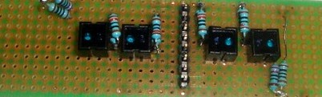
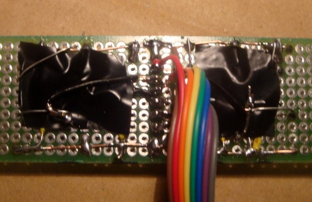
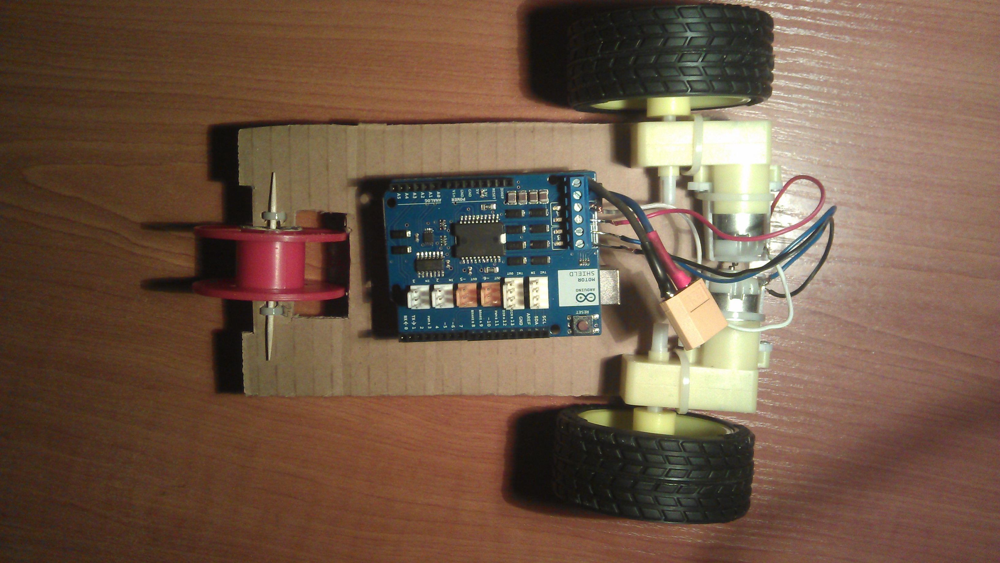

**********
Silniki DC
**********

Obsługa silników DC
======================

Zastosowanie silników DC
==========================

Line Follower
-------------

:Opis:

Pojazd podążający za linią (Line Follower) wykorzystuje gotowe moduły (Arduino UNO, Motor Shield, gotowe podwozie robota). Możemy kolejne roboty budować w oparciu o te same podzespoły. Jako oczka followera wykorzystane zostały transoptory odbiciowe CNY70. Transoptor to zestaw diody i fototranzystora. W tym przypadku jest to dioda podczerwona. 

Między pin 1 a zasilanie wpinamy rezystor :math:`300 Ω`, pin 2 podłączamy do masy. Do pinu numer 4 równolegle wpinamy rezystor :math:`50 kΩ` oraz wyjście do pinu analogowego w Arduino, a pin 3 uziemiamy.

To, czy transoptor przewodzi, będziemy sprawdzać za pomocą funkcji ``analogRead()``. Należy uważać ,by nie przegrzać i nie uszkodzić elementu - według producenta maksymalna temperatura lutowania to 260 stopni Celcjusza. Poza tym należy przygotować rezystory :math:`50 kΩ` (lutując równolegle 2 rezystory :math:`100 kΩ`) i rezystor :math:`300 Ω` (łącząc szeregowo rezystory :math:`220 Ω` i :math:`100 kΩ`). Po wsadzeniu w płytkę transoptorów proponuje się zlutować wyprowadzenia, które idą do masy i dopiero do nich przylutować zworkę. Dla ułatwienia warto po obu stronach płytki poprowadzić długie zworki z drutu, masę i magistralę zasilania.

Następnie lutujemy kolejno “wszystkie masy”. Teraz kolej na zasilanie diod podczerwonych. Należy pamiętać o wlutowaniu rezystora ograniczającego. Następnie należy wlutować rezystory :math:`50 kΩ` z układu pomiarowego, zlutować zworek między nimi a transoptorami oraz dolutować wyprowadzenia.

Trzeba jeszcze doprowadzić sygnał z i do Arduino. Do tego autor projektu proponuje wykorzystać przewód ośmiożyłowy i goldpiny. Najpierw wlutowujemy goldpiny, a następnie do nich doczepiamy przewody; żeby ułatwić sobie lutowanie, trzeba zrobić na końcach przewodu małe pętelki, które później założymy na goldpin.

:Kod:

W pierwszej kolejności ma miejsce deklaracja zmiennych i funkcji. Wykorzystana zostanie `biblioteka Motor Shielda`_. 

.. code-block:: c++

	#include <MotorShield.h>

	// wypełnienie PWM silników, gdy robot jedzie prosto:
	#define predkosc 140

	// wypełnienie PWM silników, gdy robot skręca
	#define predkosc2 110					

	// jeśli funkcja analogRead() zwróci wartość większą niż 900, to czujnik jest umieszczony nad taśmą izolacyjną, a dla wartości mniejszej – nad kartką:
	#define wartosc 900

	MS_DCMotor lewy(MOTOR_B);

	MS_DCMotor prawy(MOTOR_A);

	// odpowiada za odczyt napięcia za pomocą pinów analogowych i zapisanie odczytu do struktury:
	void sprawdz(struct odczyty &odczyt);

	// analizuje wskazania transoptorów i kontroluje moc silników:
	void steruj(struct odczyty odczyt);

	// dzięki tej funkcji łatwiej znajduje się błędy:
	void drukuj(struct odczyty odczyt);

Procedury ``setup`` i ``loop`` dla Line Followera wyglądają w ten sposób:

.. code-block:: c++

	void setup()
	{
	  prawy.setSpeed(0);
	  lewy.setSpeed(0);
	  prawy.run(FORWARD|RELEASE);
	  lewy.run(FORWARD|RELEASE);
	  Serial.begin(9600);
	}

	void loop()
	{
	  sprawdz(odczyt);
	  steruj(odczyt);
	  //drukuj(odczyt);
	  delay(10);
	}

:Wykorzystane materiały:

- Arduino Uno R3

- Motor Shield R3

- Magician Chasiss

- płytka prototypowa UM-2

- 4 x transoptor CNY70

- 2 rezystory :math:`100 Ω`

- 2 rezystory :math:`220 Ω`

- 8 rezystorów :math:`100 kΩ`

- liczne zworki zrobione z rozizolowanego drutu miedzianego

Więcej informacji oraz pełny kod programu można znaleźć na `blogu Nettigo <http://starter-kit.nettigo.pl/2013/03/robo-starter-kit-czyli-pierwsze-kroki-z-robotyka-line-follower/>`_.

Beam Follower
-------------

:Opis:

W tym projekcie robot podąża za światłem latarki. Jako czujniki natężenia światła wykorzystane zostaną fototranzystory - krótszą nóżkę podłączamy do masy, dłuższą do wejścia analogowego w Arduino i rezystora. Wykorzystujemy przy tym dwa wolne wyprowadzenia widoczne na zdjęciu gotowego modułu Line Followera, przy czym na zlutowane w poprzednim projekcie transopotry należy nałożyć warstwę taśmy izolacyjnej, aby uniknąć zwarć. 
Czujniki należy względem siebie ustawić pod kątem, ponieważ zwiększa to różnicę między ilością światła padającą na oba fototranzystory.

:Kod:

.. code-block:: c++

	#include <MotorShield.h>

	MS_DCMotor prawy(MOTOR_A);
	MS_DCMotor lewy(MOTOR_B);

	//numery pinów analogowych, do których podłączone zostanę czujniki:
	#define left 2
	#define right 3

	//wartości wypełnienia PWM:
	#define predkosc 150 //prędkość, gdy robot jedzie prosto
	#define predkosc2 100 //prędkość przy skręcaniu

	//zmienne odpowiadające za czułość robota:
	#define wartoscmin 0
	#define wartoscmax 700

Funkcja ``zmierz`` odpowiada za zapis pomiaru do struktury i jednoczesne zaokrągleniu wyniku. ``map()`` pozwala przeliczyć jakiś zbiór wartości na inny, według wzoru podanego na `stronie Arduino <http://arduino.cc/en/Reference/map>`_. Zmniejszenie przedziału sprawia, że zaokrąglamy odczyty z fototranzystorów.

.. code-block:: c++

	void zmierz(struct Pomiary &odczyt)
	{
	  odczyt.lewy = map(analogRead(left), 0, 1023, wartoscmin, wartoscmax);
	  odczyt.prawy = map(analogRead(right), 0, 1023, wartoscmin, wartoscmax);
	}

Dzięki wcześniejszemu zaokrągleniu odczytów możemy zastosować proste rozwiązanie z wykorzystaniem funkcji ``steruj`` – sprawdzenie, czy napięcie na lewym fototranzystorze jest większe, mniejsze czy równe napięciu na prawym, dzięki czemu wiemy, po  której stronie jest jaśniej.

.. code-block:: c++

	void steruj(struct Pomiary odczyt)
	{
	  //jeśli fototranzystor jest wpięty między analog pin i masę:
	  if(odczyt.lewy == odczyt.prawy)
	  {
	    prawy.setSpeed(predkosc);
	    lewy.setSpeed(predkosc);
	  }

	  // jeśli więcej światła znajduje się po lewej stronie:
	  if(odczyt.lewy < odczyt.prawy)
	  {
	    prawy.setSpeed(predkosc2);
	    lewy.setSpeed(0);
	  }

	  // jeśli więcej światła znajduje się po prawej stronie:
	  if(odczyt.lewy > odczyt.prawy)
	  {
	    prawy.setSpeed(0);
	    lewy.setSpeed(predkosc2);
	  }
	}

Więcej informacji oraz pełny kod programu można znaleźć na `blogu Nettigo <http://starter-kit.nettigo.pl/2013/04/beam-follower-czyli-robot-z-arduino-goni-swiatlo/>`_.

Pojazd sterowany joystickiem
-----------------------------

:Opis:

Projekt opisuje proces konstruowania trójkołowego samochodzika o prostej konstrukcji - do kartonowego prostokąta doczepione zostały zaciskami dwa sześciowoltowe silniczki.

Na Adruino nałożony został Motor Shield, co nie jest konieczne, gdy nie korzysta się z biegu wstecznego i steruje się silnikami za pomocą PWM. Poza tym w projekcie wykorzystane zostały dwa modemy Xbee S2 oraz joystick analogowy, który wygodnie jest zastąpić Joystick Shield Kitem.

:Joystick:

Josticki analogowe to dwa potencjometry, ustawione prostopadle do siebie. Jeden odpowiada za odchylenie w osi OX, drugi w osi OY. Wychylenie drążka powoduje zmianę rezystancji tych potencjometrów, zwykle mają one rezystancję od około :math:`0 Ω` do :math:`100 kΩ`.
Problem stanowi wywynioskowanie, który przewód za co jest odpowiedzialny oraz odczyt spadku napięcie na potencjometrze, którego nie można zmierzyć bezpośrednio - autor projektu rozwiązał pierwszy problem, posiłkując się opisami pinów, natomiast drugi, mierząc spadek napięcie na rezystorze z wykorzystaniem dzielnika napięcia. To z kolei spowodowało hiperboliczną zmianę napięcia, więc konieczne jest zbadanie napięc dla wychyleń i ustalenie jak wraz z nimi zmienia się położenie drążka joysticka.

:Kod:

**Program nadawczy:**

Deklaracja zmiennych pomocniczych:

.. code-block:: c++

	int Speed[] = {0, 100, 175, 255};
	int currentSpeed;
	int currentForce;

Struktura, przechowująca odczyt wychylenia joysticka, która zostaje wysłana do pojazdu:

.. code-block:: c++

	struct paczka
	{
	  int dir;	//odpowiada za kierunek
	  int vel;	// odpowiada za prędkość
	  int turn;	// kierunek skrętu
	  int force;	/* siła, z jaką skręcamy (0/100/175/255), a dokładniej jaki jest stosunek wypełnienia PWM sterującego jednym kołem do wypełnienia PWM odpowiadającego za drugie koło */
	}
	pack;

Główne procedury programu:

.. code-block:: c++

	void setup()
	{
	  Serial.begin(9600);
	  pack_init(pack);
	  delay(5000);
	}

	void loop()
	{
	  pack_update(pack);
	  pack_to_pack(pack);
	  delay(300);
	}

|
|
|

**Program odbiorczy:**

Deklaracja zmiennych oraz bibliotek:

.. code-block:: c++

	#include <MotorShield.h>

	MS_DCMotor right(MOTOR_A);
	MS_DCMotor left(MOTOR_B);

	int Speed[] = {0, 100, 175, 255};
	int currentSpeed;

Jeśli ``pack.dir`` odpowiadające kierunkowi ma odpowiednią wartość, w tym przypadku 255, pojazd jedzie do przodu. Na tej samej zasadzie dla 0 będzie jechał do tyłu, a dla 125 zostanie włączony hamulec.

.. code-block:: c++

	void rotator_controller(struct paczka pack)
	{

	  if(pack.dir == 255)
	  {
	    right.run(RELEASE);
	    left.run(RELEASE); 
	    right.run(FORWARD);
	    left.run(FORWARD);
	    right.setSpeed(pack.vel);
	    left.setSpeed(pack.vel);
	  }

	  if(pack.dir == 0)
 	  {
	    right.run(RELEASE);
	    left.run(RELEASE); 
	    right.run(BACKWARD);
	    left.run(BACKWARD);
	    right.setSpeed(pack.vel);
	    left.setSpeed(pack.vel);
	  }

	  if(pack.dir == 125)
	  {
	    right.run(BRAKE);
	    left.run(BRAKE);
	    right.setSpeed(Speed[0]);
	    left.setSpeed(Speed[0]);
	  }

Skręcanie polega tu na różnicy wypełnienia PWM sterującego pierwszym i drugim kołem:

.. code-block:: c++

	if(pack.turn == 125) /*left*/
	{
	  right.setSpeed(pack.vel);

	  if(pack.force == 100)
	    left.setSpeed(pack.vel/1.5);

	  if(pack.force == 175)
	    left.setSpeed(pack.vel/2);

	  if(pack.force == 255)
	    left.setSpeed(pack.vel/3);
	}

Więcej informacji oraz pełny kod programu można znaleźć na `blogu Nettigo <http://starter-kit.nettigo.pl/2012/12/samochodzik-czyli-jak-wykorzystac-modem-xbee/>`_.

.. _biblioteka Motor Shielda: https://github.com/hanseartic/MotorShield
